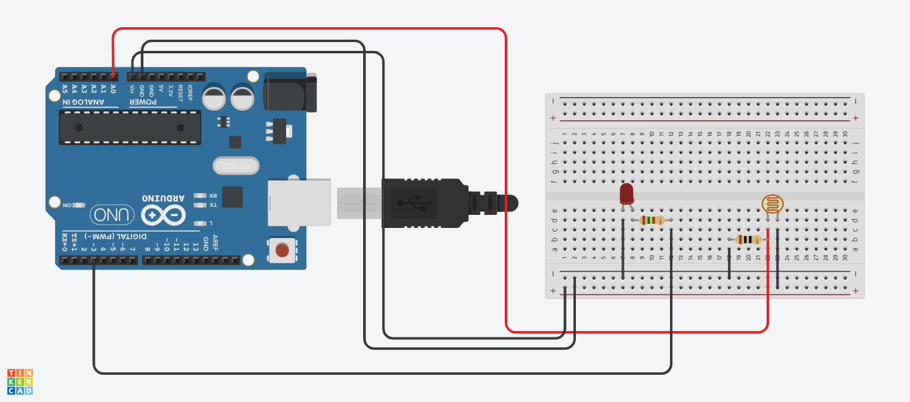

# Fotoresistor

# Introdução 
Este projeto do foto resistor serve para acionar dispositivos eletronicos diversos
usado para interagir com tecnologia de ponta.
-ld usado para ligar ao ser axacutado
-resistores para ligar o led no arduino

# Materiais
-1 led
-2 resistores
-1 fotoresistor

# Código

variaveis
int led = 3;
int sensordeluminosidade = A0;
variavel para capturar a luminosidade
int luz =0;
void setup()
{
pinMode (led,OUTPUT);//led de saída
  //sensor é de entrada 
 pinMode(sensordeluminosidade,INPUT);
}
void loop()
{
  capturar o que o sensor leu no ambiente
  analogRead é usado para a leitura analogica
  luz = analogRead(sensordeluminosidade);
  as portas analogicas capturam dados que variam
  de 0 até 1023
  
  SE ESTIVER COM POUCA LUZ NO AMBIENTE
  if(luz<500){
  passa o led na intencidade maxima
  analogWrite(led,1023);
  }
  if(luz>=500 && luz<900){
  passar ao led a intencidade média
    analogWrite(led,500);
  }else{//se tiver luz
    analogWrite(led,0);  }
}
  

