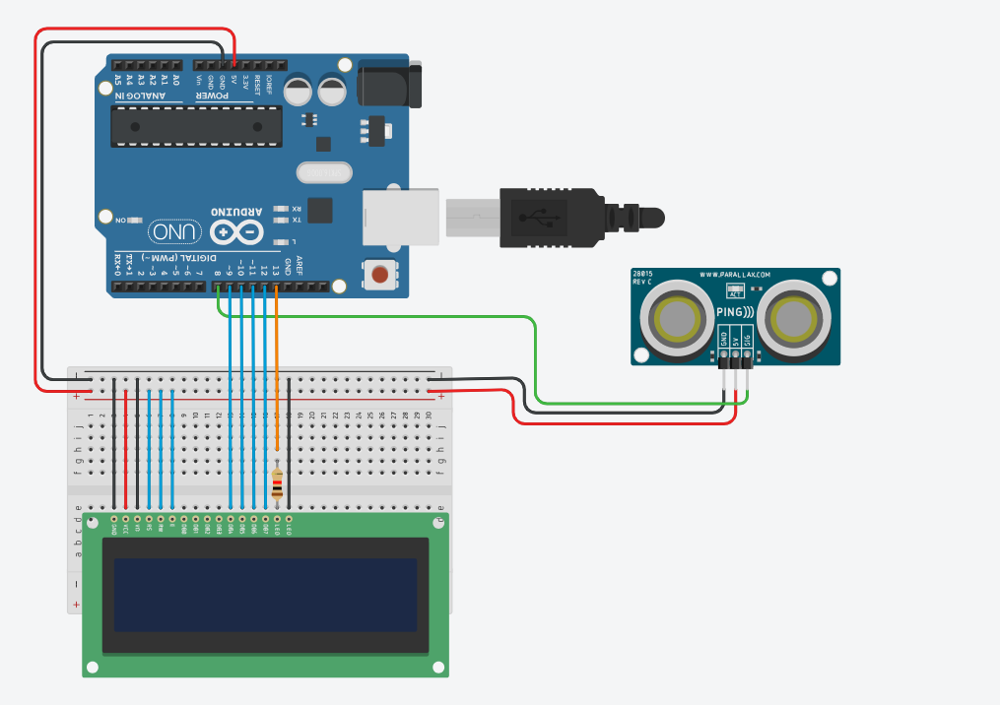

Ledinteligente

#Introdução
Essa função de led que se acende em seguencia ordenada. com essa função 
demligar os leds de forma oedenada, da para fazer um semaforo de forma pratica.
- deve acender os leds 1 LED VERDE, 1 VEREMLHO, 1 AZUL.
- deve acender os leds 2 AZUIS E 2 VERDES
- deve acender os leds 1 VERDE , 2 VERMELHOS E 1 AZUL.
# Materiais
- 1 arduino
- 10 leds
- 8 resistores

 # código
 
# Projeto de Controle de LEDs

Este projeto utiliza um Arduino para controlar múltiplos LEDs. Os LEDs acendem em sequência com um intervalo de 1 segundo entre cada um.

## Tabela de Conteúdo

- [Descrição do Código](#descrição-do-código)
- [Componentes Necessários](#componentes-necessários)
- [Como Usar](#como-usar)
- [Estrutura do Código](#estrutura-do-código)

## Descrição do Código

O código controla seis LEDs (verde, vermelho e azul) conectados a um Arduino. Cada LED acende em sequência e permanece aceso por um segundo antes que o próximo LED seja ativado.

## Componentes Necessários

- 1 Placa Arduino (por exemplo, Arduino Uno)
- 6 LEDs (2 verdes, 3 vermelhos, 2 azuis)
- 6 resistores (220Ω recomendados)
- Fios de conexão
- Protoboard

## Como Usar

1. Conecte os LEDs aos pinos digitais do Arduino conforme especificado no código.
2. Faça upload do código para o Arduino utilizando a IDE do Arduino.
3. O programa começará a executar automaticamente, acendendo os LEDs em sequência.

## Estrutura do Código

O código está dividido em duas partes principais: `setup()` e `loop()`.

### `setup()`

}

