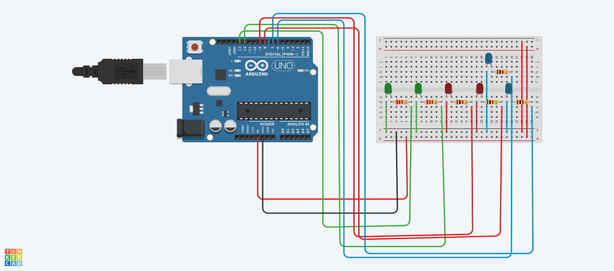

# Mini Led

# Introdução

Este projeto serve para ligar leds de forma ordenada na forma que voçê quiser
- Com o código simples pode ligar 2 leds verdes primeiro 2 vermelo e 2 azull

  # Material

  - 1 Arduino
  - 1 placa de ensaio
  - 6 leds (2 vermelhos 2 verde 2 azul)
  - 6 resistores
 
    # Código

int ledVerde = 13;
int ledVerdee = 12;
int ledVermelho = 9;
int ledVermelhoo = 8;
int ledAzul = 7;
int ledAzull = 6;
  
void setup()
{
  pinMode(ledVerde, OUTPUT);
  pinMode(ledVerdee, OUTPUT);
  pinMode(ledVermelho, OUTPUT);
  pinMode(ledVermelhoo, OUTPUT);
  pinMode(ledAzul, OUTPUT);
  pinMode(ledAzull, OUTPUT);

}

void loop()
{
  digitalWrite(ledVerde, HIGH);
  delay(1000); // Wait for 1000 millisecond(s)
  digitalWrite(ledVermelho, HIGH);
  delay(1000); // Wait for 1000 millisecond(s)
   digitalWrite(ledAzul, HIGH);
  delay(1000); // Wait for 1000 millisecond(s)
 
  digitalWrite(ledVerde, HIGH);
  delay(1000); // Wait for 1000 millisecond(s)
  digitalWrite(ledVerdee, HIGH);
  delay(1000); // Wait for 1000 millisecond(s)
   digitalWrite(ledAzul, HIGH);
  delay(1000); // Wait for 1000 millisecond(s)
   digitalWrite(ledAzull, HIGH);
  delay(1000); // Wait for 1000 millisecond(s)

   digitalWrite(ledVerde, HIGH);
  delay(1000); // Wait for 1000 millisecond(s)
  digitalWrite(ledVermelho, HIGH);
  delay(1000); // Wait for 1000 millisecond(s)
   digitalWrite(ledVermelhoo, HIGH);
  delay(1000); // Wait for 1000 millisecond(s)
   digitalWrite(ledAzull, HIGH);
  delay(1000); // Wait for 1000 millisecond(s)
}

