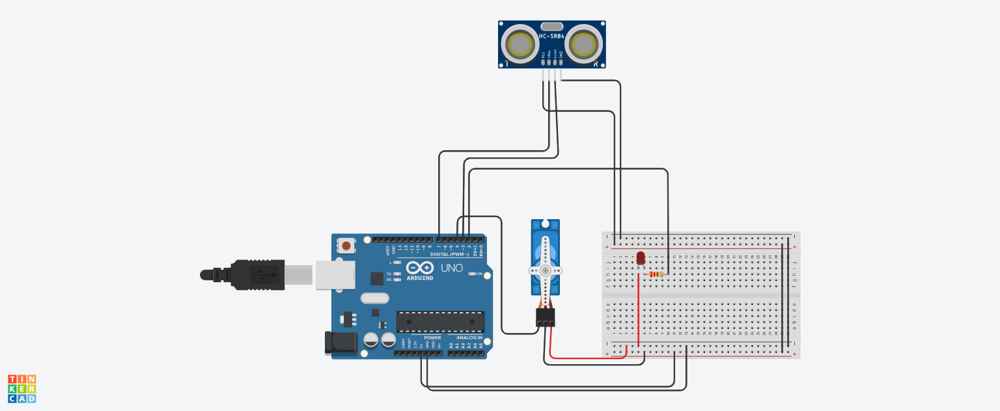

## Sensor de Movimento Arduino

#Introdução

-Este projeto visa montar um arduino como se fosse a cabeça de um robô, quando chegar em uma 
determinada distancia de um objeto acenda uma luz vermelha e o micro servo vira a cabeça para o lado.
-quando o sensor de movimento estiver perto de algo imediatamente ligar uma luz e tambem o micro servo 
vira para o lado desviando do objeto a frente.

#Equipamentos Ultilizados

-1 Arduino uno
-1 Placa de ensaio
-1 Sensor de Movimento
-1 micro servo
-1 led
-1 resistor

#Imagem do arduino

