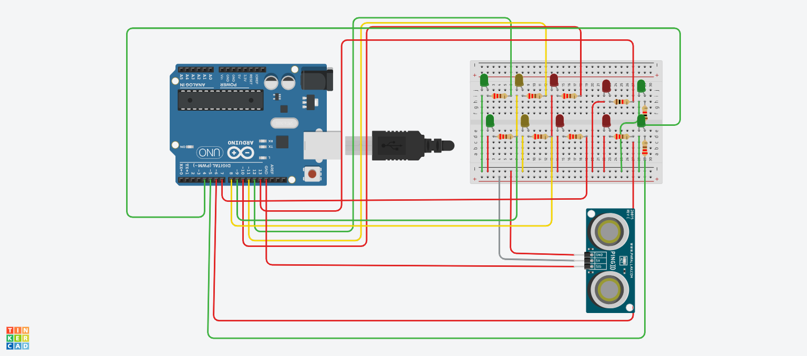

# Semaforo de Rua

# Introdução

Este projeto é feito para o futuro e construido de forma eficiente, e um estilo de semaforo inteligente que quando o pedestre quer atravesar uma avenida movimentada
tenha um botão que ele aperte e altomaticamente os semaforos dos altomoveis ficam amarelo e depois vermelho.
já o semaforo dos pedestres fica verde apos os semaforos dos carros ficarem vermelho.
- Como explicado de forma simplificada a cima, este projeto facilita o vida dos pedestre.

 # Materiais 

- 10 Leds (4 vermelho 4 verdes 2 amarelo)
- 10 resistores
- 1 sensor de movimento
- 1 arduino
- 1 placa de ensaio

  # Código

const int semaforoVermelhoCarro1 = 10;
const int semaforoAmareloCarro1 = 11;
const int semaforoVerdeCarro1 = 12;
const int semaforoVermelhoCarro2 = 7;
const int semaforoAmareloCarro2 = 6;
const int semaforoVerdeCarro2 = 5;

const int semaforoVermelhoPedestre1 = 13;
const int semaforoVerdePedestre1 = 4;
const int semaforoVermelhoPedestre2 = 6;
const int semaforoVerdePedestre2 = 5;

const int pinTrig = 12;
const int pinEcho = 13;

void setup() {
   LEDs dos carros
  pinMode(semaforoVermelhoCarro1, OUTPUT);
  pinMode(semaforoAmareloCarro1, OUTPUT);
  pinMode(semaforoVerdeCarro1, OUTPUT);
  pinMode(semaforoVermelhoCarro2, OUTPUT);
  pinMode(semaforoAmareloCarro2, OUTPUT);
  pinMode(semaforoVerdeCarro2, OUTPUT);

  LEDs dos pedestres
  pinMode(semaforoVermelhoPedestre1, OUTPUT);
  pinMode(semaforoVerdePedestre1, OUTPUT);
  pinMode(semaforoVermelhoPedestre2, OUTPUT);
  pinMode(semaforoVerdePedestre2, OUTPUT);

  Sensor de distância
  pinMode(pinTrig, OUTPUT);
  pinMode(pinEcho, INPUT);
  
 Inicia os semáforos
  iniciarSinaisCarros();
}

void loop() {
  long duracao, distancia;
  
   Ativa o sensor de distância
  digitalWrite(pinTrig, LOW);
  delayMicroseconds(2);
  digitalWrite(pinTrig, HIGH);
  delayMicroseconds(10);
  digitalWrite(pinTrig, LOW);
  
  duracao = pulseIn(pinEcho, HIGH);
  distancia = (duracao * 0.034) / 2; // cm

  if (distancia < 50) {
     Pedestre detectado
    pararSinaisCarros();
    iniciarSinaisPedestres();
    delay(15000); // Espera 15 segundos
    pararSinaisPedestres();
    iniciarSinaisCarros();
  }
}

void iniciarSinaisCarros() {
  digitalWrite(semaforoVermelhoCarro1, LOW);
  digitalWrite(semaforoAmareloCarro1, LOW);
  digitalWrite(semaforoVerdeCarro1, HIGH);
  digitalWrite(semaforoVermelhoCarro2, LOW);
  digitalWrite(semaforoAmareloCarro2, LOW);
  digitalWrite(semaforoVerdeCarro2, HIGH);
}

void pararSinaisCarros() {
  digitalWrite(semaforoVermelhoCarro1, HIGH);
  digitalWrite(semaforoAmareloCarro1, LOW);
  digitalWrite(semaforoVerdeCarro1, LOW);
  digitalWrite(semaforopararSinaisCarros() {
  digitalWrite(semaforoVermelhoCarro1, HIGH);
  digitalWrite(semaforoAmareloCarro1, LOW);
  digitalWrite(semaforoVerdeCarro1, LOW);
  digitalWrite(semaforoVermelhoCarro2, HIGH);
  digitalWrite(semaforoAmareloCarro2, LOW);
  digitalWrite(semaforoVerdeCarro2, LOW);
}

void iniciarSinaisPedestres() {
  digitalWrite(semaforoVermelhoPedestre1, LOW);
  digitalWrite(semaforoVerdePedestre1, HIGH);
  digitalWrite(semaforoVermelhoPedestre2, LOW);
  digitalWrite(semaforoVerdePedestre2, HIGH);
}

void pararSinaisPedestres() {
  digitalWrite(semaforoVermelhoPedestre1, HIGH);
  digitalWrite(semaforoVerdePedestre1, LOW);
  digitalWrite(semaforoVermelhoPedestre2, HIGH);
  digitalWrite(semaforoVerdePedestre2, LOW);
}

 

