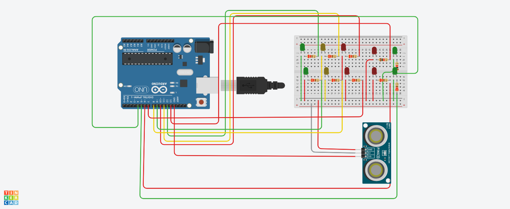

# semaforo inteligente  

# introdução

Este projeto foi feito para facilitar a vida dos pedestres, e trazer mais segurança tanto para os pedestres quanto para os carros.
 O projeto era:
 -criar três semaforos para carros (1 verde e 1 verde e 1 vermelho). tendo em mente que são duas pistas indo e voltando.
 -criar mais três semaforos para carros (1 verde e 1 verde e 1 vermelho). tendo em mente que são duas pistas indo e voltando.
 -criar dois semaforos para os pedestres sendo (1 verde e 1 vermelho) para umas das pistas
 -criar mais dois semaforos para os pedestres (1 verde e 1 vermelho) para umas das pistas
 -Este projeto serve como dito acima, é para facilitar a vida de quem esta nas rua.
 -Quando tiver pedestres querendo atravesar para o outro lado da rua ele aperta um botão e todos os semaforo dos dois lados ficarão vermelho.
 -Porem, enquanto os pedestres não apertar o botão o semaforo dos carros continua verde.
 -Outra resalva, na hora que o pedestre for atravessar o sinal do pedestre fica verde, mais os dos carros fica amarelo, por isso tem que ter atenção.
 -Os semaforos ficarão verde por 15 segundos.

 # Material
 - 1 arduino uno
 - 1 placa de ensaio
 - 1 sensor de distância
 - 10 leds
 - 8 resistores

 # Código

Este código implementa um sistema de controle de semáforos para veículos e pedestres utilizando um Arduino.
Ele define constantes para os pinos dos LEDs dos semáforos e um sensor de distância. No setup, os pinos são
configurados como saída ou entrada e os semáforos de carros são iniciados. No loop, o sistema mede a distância usando
o sensor; se um pedestre é detectado a menos de 50 cm, os sinais dos carros são interrompidos e os semáforos para pedestres são
ativados por 15 segundos. As funções iniciarSinaisCarros, pararSinaisCarros, iniciarSinaisPedestres e pararSinaisPedestres
controlam os LEDs correspondentes.

# imagen

