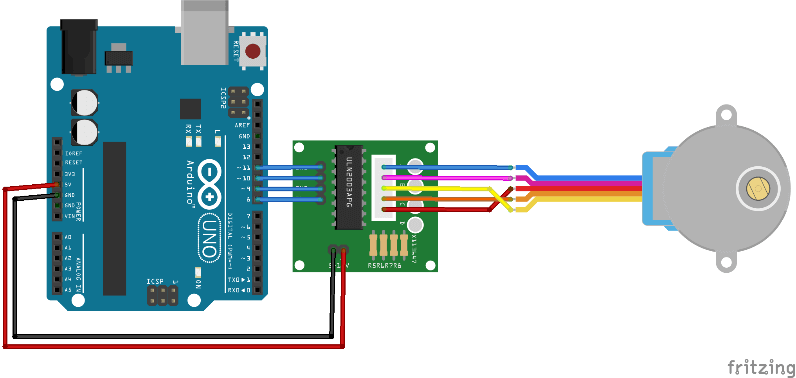

#Stap Motor

# Introdução
Esse código foi feito no arduino.uno na disciplina de IOT 'Internet das Coisas' é um exemplo básico de controle de um motor de passo usando
a biblioteca AcceLStepper. Ele define as configurações do motor, como a velocidade e a aceleração, e converte graus em passos, permitindo
que o motor execute movimentos precisos. Através da função moveTo, o motor é programado para girar uma volta completa (360°), que corresponde
a 1024 passos. A estrutura do código é composta por duas partes principais: a configuração inicial no setup() e a execução contínua no loop(), onde
o motor é acionado a se mover para a posição desejada.

# Materiais
- 1 Controlador
- 1 arduino.uno
- 1 stap motor

  # Código

incluir a biblioteca
#include <AcceLStepper.h>// conversão de graus para steps
360° = 1024
180 = 512
90 = 256
60 = 170
45 = 128

variavel para controlar as voltas do motor
#define Voltas 1024
criando objeto para controlar o motor
AcceLStepper motor (AcceLStepper::FULL4WIRE,8,10,9,11)

void setup() {
definir a velocidade maxima do motor
motor.setMaxSpeed(1000);
definir aceleração maxima do motor
motor.setAceleration(100);

}
void loop() {
habilitar as portas de controle do motor no arduino
motor.run();
 fazer o motor se movimentar a 360°/1024 passos
motor.moveTo(Voltas);
}
//incluir a biblioteca
#include <AcceLStepper.h>
// conversão de graus para steps
//360° = 1024
//180 = 512
//90 = 256
//60 = 170
//45 = 128

//variavel para controlar as voltas do motor
#define Voltas 1024
//criando objeto para controlar o motor
AcceLStepper motor (AcceLStepper::FULL4WIRE,8,10,9,11)

void setup() {
//definir a velocidade maxima do motor
motor.setMaxSpeed(1000);
//definir aceleração maxima do motor
motor.setAceleration(100);

}

void loop() {
//habilitar as portas de controle do motor no arduino
motor.run();
// fazer o motor se movimentar a 360°/1024 passos
motor.moveTo(Voltas);
}
//incluir a biblioteca
#include <AcceLStepper.h>
// conversão de graus para steps
//360° = 1024
//180 = 512
//90 = 256
//60 = 170
//45 = 128

//variavel para controlar as voltas do motor
#define Voltas 1024
//criando objeto para controlar o motor
AcceLStepper motor (AcceLStepper::FULL4WIRE,8,10,9,11)

void setup() {
//definir a velocidade maxima do motor
motor.setMaxSpeed(1000);
//definir aceleração maxima do motor
motor.setAceleration(100);

}

void loop() {
//habilitar as portas de controle do motor no arduino
motor.run();
// fazer o motor se movimentar a 360°/1024 passos
motor.moveTo(Voltas);
}

